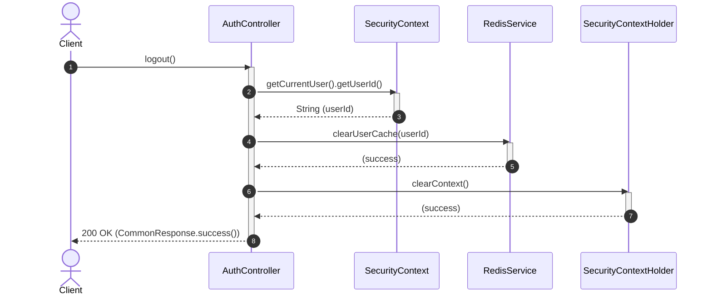

# [A0003] 로그아웃 API

사용자 로그아웃 처리를 위한 API입니다.

### [기본 정보]
| 항목 | 내용 |
| :--- | :--- |
| **API Code**| `A0003` |
| **URL** | `/api/v1/auth/logout` |
| **HTTP Method** | `POST` |
| **요청 Content-Type** | 해당 없음. |
| **응답 Content-Type** | `application/json; charset=utf-8` |

---

### [Request]

#### HEADER
| 파라미터명 | 타입 | 필수여부 | 설명 |
| :--- | :---: | :---: | :--- |
| `Authorization` | String | O | `Bearer {accessToken}` |

#### BODY
해당 없음.

---

### [Response]

| 파라미터명 | 타입 | 필수여부 | 설명 |
| :--- | :---: | :---: | :--- |
| **status** | String | O | SC, FA 반환 |
| **message** | String | O | 결과 메시지 |

---

### [Response Example]
```json
{
  "status": "SC",
  "message": "로그아웃 되었습니다."
}
```

---

### [Sequence Diagram]

