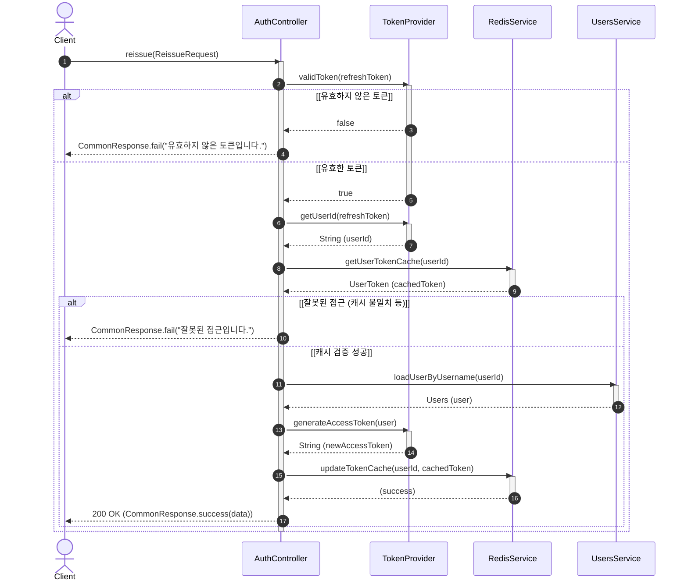

# [A0004] 토큰 재발급 API

만료된 Access Token을 Refresh Token을 통해 재발급 받기 위한 API입니다.

### [기본 정보]
| 항목 | 내용 |
| :--- | :--- |
| **API Code**| `A0004` |
| **URL** | `/api/v1/auth/reissue` |
| **HTTP Method** | `POST` |
| **요청 Content-Type** | `application/json` |
| **응답 Content-Type** | `application/json; charset=utf-8` |

---

### [Request]

#### HEADER
해당 없음.

#### BODY
| 파라미터명 | 타입 | 필수여부 | 설명 |
| :--- | :---: | :---: | :--- |
| `refreshToken` | String | O | 기존에 발급받은 Refresh Token |

---

### [Response]

| 파라미터명(1) | 파라미터명(2) | 타입(1) | 타입(2) | 필수여부 | 설명 |
| :--- | :--- | :---: | :---: | :---: | :--- |
| **status** | | String | | O | SC, FA 반환 |
| **message** | | String | | O | 결과 메시지 |
| **data** | | json | | X | FA이면 data값 없음 |
| | **accessToken** | | String | X | 새로 발급된 Access Token |

---

### [Response Example]
```json
{
  "status": "SC",
  "message": "토큰 재발급에 성공하였습니다.",
  "data": {
    "accessToken": "eyJhbGciOiJIUzI1NiJ9.eyJ..."
  }
}
```

---

### [Sequence Diagram]

