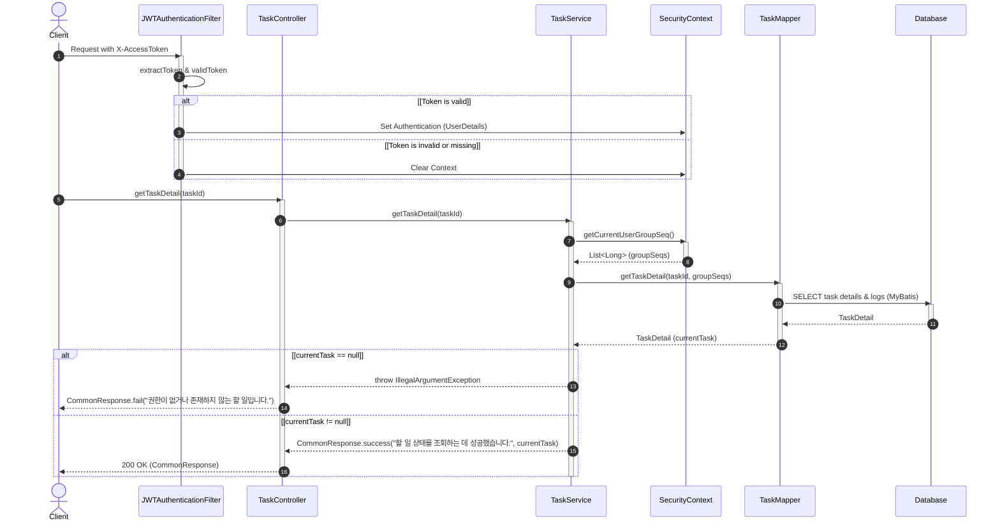

# [T0005] 특정 태스크의 이력 조회 API

선택한 할 일의 상세 내역과 처리 이력(로그)을 조회하는 API입니다.

### [기본 정보]
| 항목 | 내용 |
| :--- | :--- |
| **API Code**| `T0005` |
| **URL** | `/api/v1/tasks/{id}/logs` |
| **HTTP Method** | `POST` |
| **요청 Content-Type** | `application/json` |
| **응답 Content-Type** | `application/json; charset=utf-8` |

---

### [Request]

#### HEADER
| 파라미터명 | 타입 | 필수여부 | 설명 |
| :--- | :---: | :---: | :--- |
| `X-AccessToken` | String | O | 인증 토큰 |

#### BODY
해당 없음.

---

### [Response]

| 파라미터명(1) | 파라미터명(2) | 파라미터명(3) | 타입(1) | 타입(2) | 필수여부 | 설명 |
| :--- | :--- | :--- | :---: | :---: | :---: | :--- |
| **status** | | | String | | O | SC, FA 반환 |
| **message** | | | String | | O | 결과 메시지. (FA이면 data값 없음) |
| **data** | | | json | | X | |
| | **taskId** | | | Long | X | |
| | **title** | | | String | X | |
| | **duedate** | | | String | X | ISO 8601 (YYYY-MM-DD) |
| | **taskStatus** | | | String | X | CREATED, COMPLETED, UNCOMPLETED |
| | **creator** | | | String | X | |
| | **modifier** | | | String | X | |
| | **groupName** | | | String | X | |
| | **taskLogDetailList** | | | list | X | |
| | | **id** | | | Long | X | |
| | | **status** | | | String | X | |
| | | **creator** | | | String | X | |
| | | **createdAt** | | | String | X | ISO 8601 (YYYY-MM-DDTHH:mm:ss) |

---

### [Response Example]
```json
{
  "status": "SC",
  "message": "할 일 상태를 조회하는 데 성공했습니다.",
  "data": {
    "taskId": 1,
    "title": "요구사항 분석",
    "duedate": "2026-03-05",
    "taskStatus": "COMPLETED",
    "creator": "김아무개",
    "modifier": "이아무개",
    "groupName": "개발1팀",
    "taskLogDetailList": [
      {
        "id": 1,
        "status": "CREATED",
        "creator": "김아무개",
        "createdAt": "2026-02-28T09:00:00"
      },
      {
        "id": 2,
        "status": "COMPLETED",
        "creator": "이아무개",
        "createdAt": "2026-02-28T12:00:00"
      }
    ]
  }
}
```

---

### [Sequence Diagram]

