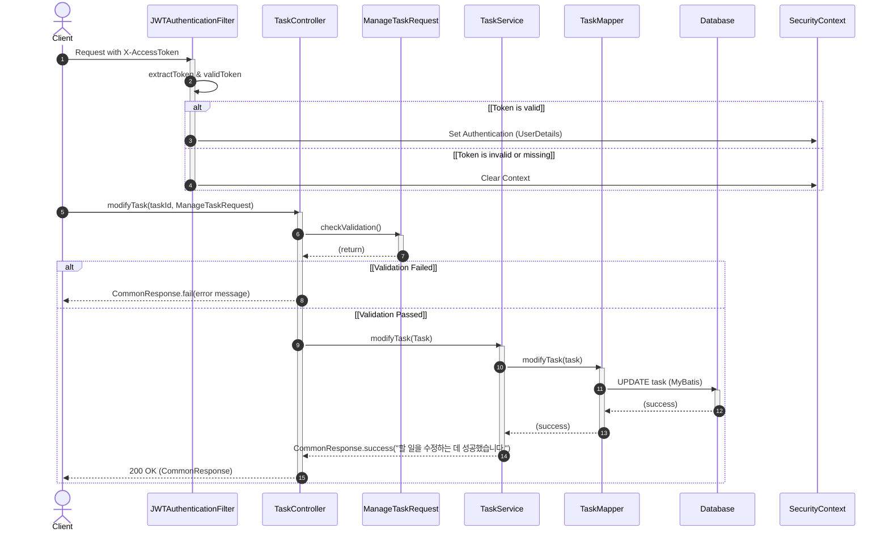

# [T0002] 할 일 내용 수정 API

기존에 등록된 할 일 목록의 내용을 수정하는 API입니다.

### [기본 정보]
| 항목 | 내용 |
| :--- | :--- |
| **API Code**| `T0002` |
| **URL** | `/api/v1/tasks/{id}` |
| **HTTP Method** | `POST` |
| **요청 Content-Type** | `application/json` |
| **응답 Content-Type** | `application/json; charset=utf-8` |

---

### [Request]

#### HEADER
| 파라미터명 | 타입 | 필수여부 | 설명 |
| :--- | :---: | :---: | :--- |
| `X-AccessToken` | String | O | 인증 토큰 |

#### BODY
| 파라미터명 | 타입 | 필수여부 | 설명 |
| :--- | :---: | :---: | :--- |
| `title` | String | O | 할 일 제목 |
| `groupSeq` | Long | O | 그룹 순번 |
| `duedate` | String | O | 마감 기한 (YYYY-MM-DD) |

---

### [Response]

| 파라미터명 | 타입 | 필수여부 | 설명 |
| :--- | :---: | :---: | :--- |
| **status** | String | O | SC, FA 반환 |
| **message** | String | O | 결과 메시지 |

---

### [Response Example]
```json
{
  "status": "SC",
  "message": "할 일을 수정하는 데 성공했습니다."
}
```

---

### [Sequence Diagram]

