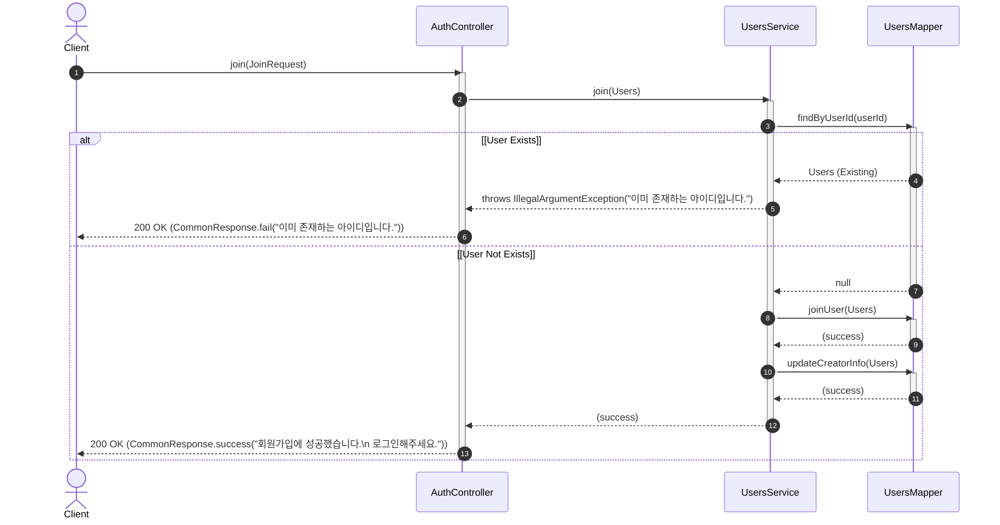

# [A0002] 회원가입 API

새로운 사용자를 등록하기 위한 회원가입 API입니다.

### [기본 정보]
| 항목 | 내용 |
| :--- | :--- |
| **API Code**| `A0002` |
| **URL** | `/api/v1/auth/join` |
| **HTTP Method** | `POST` |
| **요청 Content-Type** | `application/json` |
| **응답 Content-Type** | `application/json; charset=utf-8` |

---

### [Request]

#### HEADER
해당 없음.

#### BODY
| 파라미터명 | 타입 | 필수여부 | 설명 |
| :--- | :---: | :---: | :--- |
| `userId` | String | O | |
| `userName` | String | O | |
| `password` | String | O | |
| `avatarImg` | String | O | Base64인코딩하여 전달 |

---

### [Response]

| 파라미터명(1) | 파라미터명(2) | 타입(1) | 타입(2) | 필수여부 | 설명 |
| :--- | :--- | :---: | :---: | :---: | :--- |
| **status** | | String | | O | SC, FA 반환 |
| **message** | | String | | O | |

---

### [Response Example]
```json
{
  "status": "SC",
  "message": "성공"
}
```

---

### [Sequence Diagram]

